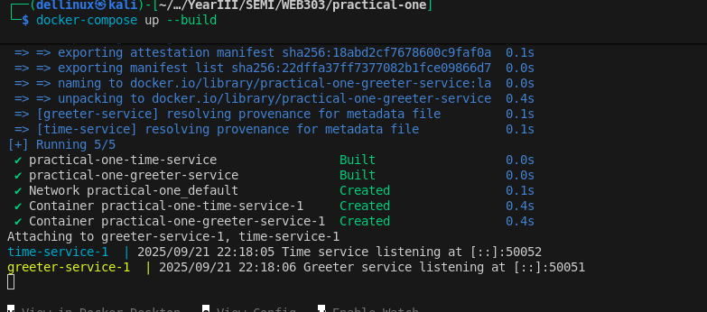
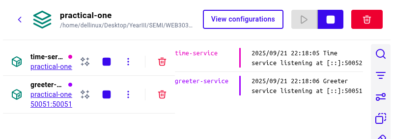
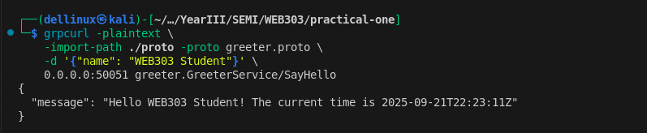

# Practical 1: From Foundational Setup to Inter-Service Communication


## Objective
The goal of this practical was to set up a development environment for microservices and build a simple multi-service application using **Go**, **gRPC**, and **Docker Compose**.  

I created **two microservices** – a **time-service** and a **greeter-service** – that communicate over gRPC, demonstrating inter-service communication, containerization, and orchestration.


## Tools and Technologies Used
| Technology | Purpose / Why Used |
|------------|------------------|
| **Go** | Fast, compiled language with excellent concurrency support, ideal for lightweight microservices. |
| **Protocol Buffers (Protobuf)** | Define strict data contracts between services in a language-agnostic, efficient binary format. |
| **gRPC** | Enables efficient, structured communication between services. |
| **Docker** | Runs services in isolated containers to ensure consistency across environments. |
| **Docker Compose** | Orchestrates multiple containers, managing dependencies and networking between them. |
| **grpcurl** | CLI tool to test gRPC endpoints without writing additional client code. |


## What I Did and Learned

### 1. Development Environment Setup
I installed and configured Go, Protocol Buffers, and Docker.  

**Learnings:**
- Go’s simplicity and concurrency model make it suitable for microservices.  
- Protobuf ensures services agree on message structure, reducing communication errors.  
- Docker allows services to run in isolated, reproducible environments.  


### 2. Building the Microservices
I implemented two services:

1. **Time-Service**  
   - Returns the current time when requested.  
   - Runs as a gRPC server listening on port 50052.  

2. **Greeter-Service**  
   - Receives a name from the client.  
   - Calls the time-service to get the current time.  
   - Returns a greeting message including the current time.  
   - Runs as a gRPC server on port 50051.  

**Learnings:**  
- Using gRPC allowed structured and efficient communication between services.  
- Creating a client inside greeter-service showed real inter-service calls.  
- Go modules and packages help organize service logic cleanly.  


### 3. Containerization and Orchestration
I containerized both services using Docker and managed them with Docker Compose.  

**Why This Matters:**  
- Docker ensures services run consistently regardless of the host system.  
- Docker Compose starts multiple containers, handles dependencies, and allows them to communicate over a virtual network.  

**Result:** Both containers started successfully, greeter-service could call time-service, and logs confirmed successful requests.





### 4. Testing the Endpoint
I tested the greeter-service using **grpcurl**, simulating a client call:

**Command Used:**
```bash
grpcurl -plaintext \
    -import-path ./proto -proto greeter.proto \
    -d '{"name": "WEB303 Student"}' \
    0.0.0.0:50051 greeter.GreeterService/SayHello
```
**Result:**




### Learnings

- Confirmed inter-service communication works correctly.
- Observed how services log requests and responses.


## Conclusion

This practical helped me achieve the following:

- **Set up a robust microservices development environment** using Go, Protobuf, gRPC, and Docker.
- **Built and ran two communicating microservices**, learning about service contracts, client-server interactions, and gRPC structure.
- **Learned containerization and orchestration** with Docker Compose.
- **Gained hands-on experience** in testing services using `grpcurl`.

Overall, I now have a strong understanding of how microservices communicate, why containerization is important, and how to orchestrate multiple services, providing a solid foundation for real-world microservice applications.

