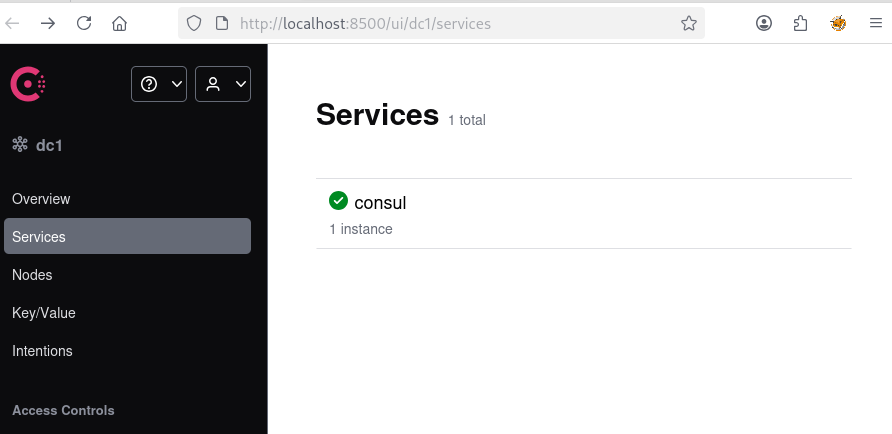
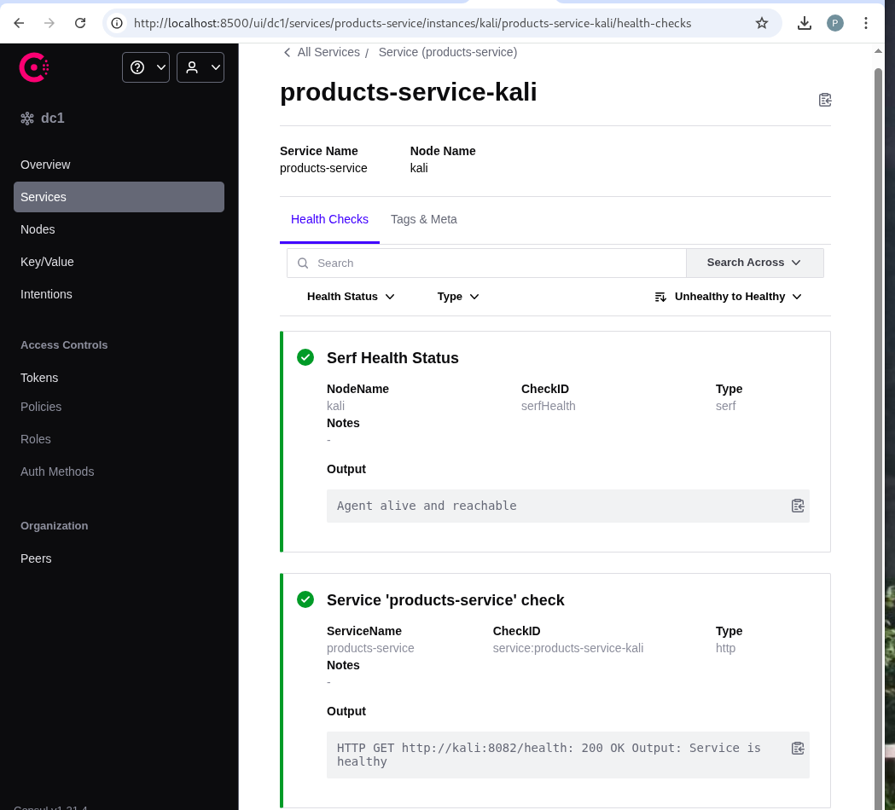
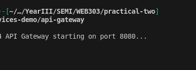
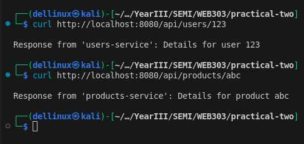
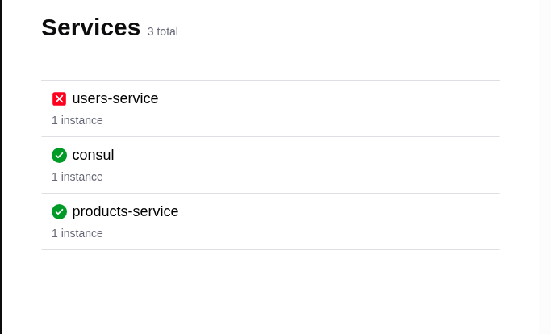
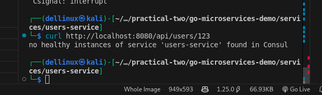
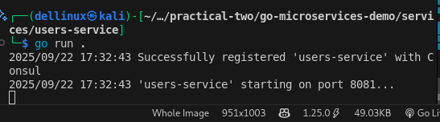
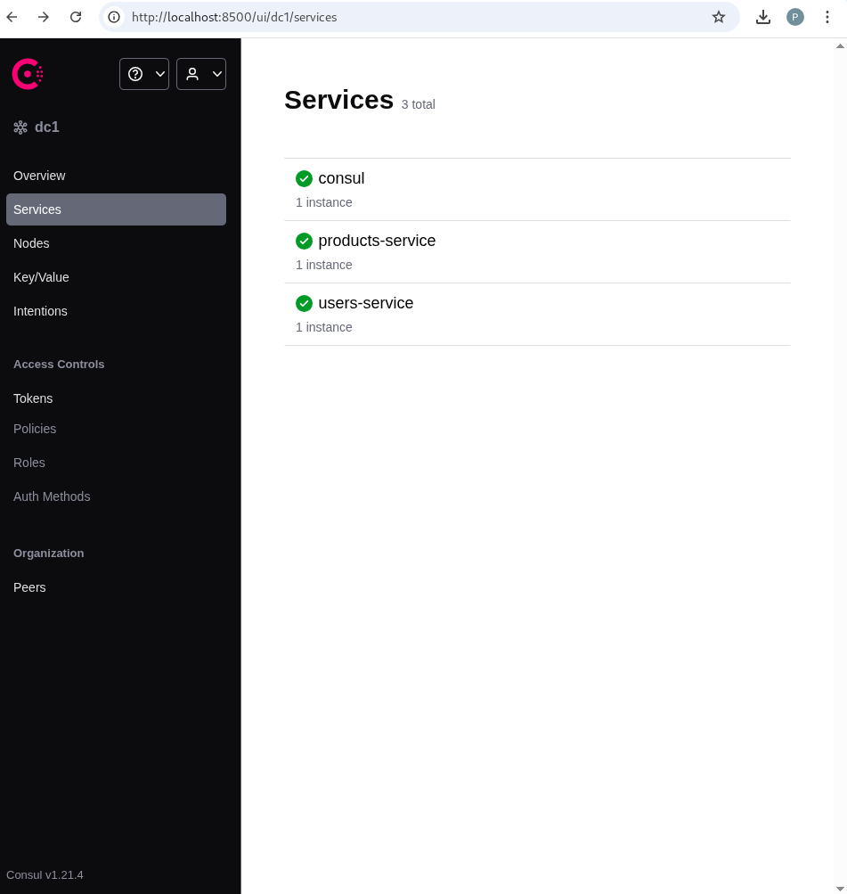

# Practical 2: API Gateway with Service Discovery


## 1. Introduction

In this practical, we created a small microservices ecosystem with two independent services: **users-service** and **products-service**.  

These services do not know about each other directly. Instead, they register themselves with a central "phone book" called **Consul** (service registry).  

An **API Gateway** acts as a receptionist: it receives all requests, checks Consul for the service address, and forwards the request to the correct service.  

This setup allows us to update, restart, or scale services without touching the other parts of the system. It demonstrates **resilient and maintainable architecture**.

By doing this, I learned how to:

- Make services independent, scalable, and resilient  
- Use **Consul** for service registration and health monitoring  
- Dynamically route requests through an API Gateway  
- Understand how decoupled services improve maintenance  


## 2. System Architecture

Here is the system structure I implemented:

```
+----------------+
|  API Gateway   |
|  (Port 8080)   |
+-------+--------+
        |
        v
+-------+--------+
| Service Registry|
|     Consul     |
+-------+--------+
        |
        v
+----------------+    +----------------+
| users-service  |    | products-service|
|   Port 8081    |    |   Port 8082    |
+----------------+    +----------------+
```


**Explanation:**

- **API Gateway:** Receives all external requests and decides where to send them. This avoids exposing multiple service ports to users.  
- **Consul:** Works like a "phone book" . Each service tells Consul "I exist and I am healthy," and the gateway asks Consul where to send requests.  
- **Users-service & Products-service:** Independent services running on different ports. Each service registers itself with Consul and provides a health check endpoint.  


## 3. Prerequisites

Before starting, I installed and verified:

- **Go Language (v1.18+)** for building services  
- **Docker & Docker Compose** for running Consul  
- **Go libraries:** `chi` for routing and `consul/api` for Consul integration  
- **Optional tools:** cURL & Postman for testing API endpoints  

All tools were verified using:

```bash
go version
docker --version
curl -I https://proxy.golang.org
```


## 4. Project Structure

To keep everything organized, I created this structure:

```
go-microservices-demo/
├── api-gateway/
│   └── main.go
└── services/
    ├── users-service/
    │   └── main.go
    └── products-service/
        └── main.go
```

**Why this structure:**

- Keeps services isolated
- Makes it easy to add more services in the future
- Allows the API Gateway to be completely separate


## 5. Steps Performed

### 5.1 Running Consul

I ran Consul in development mode using Docker:

```bash
docker run -d -p 8500:8500 --name=consul hashicorp/consul agent -dev -ui -client=0.0.0.0
```

**Explanation:**

- `-dev`: Runs a single-node development Consul, perfect for learning
- `-ui`: Enables web interface
- `-client=0.0.0.0`: Allows services on my host machine to connect

After this, I opened http://localhost:8500/ui and saw the Consul UI with no services registered yet.



---

### 5.2 Building users-service

**Steps:**

1. Initialized Go module:

```bash
go mod init users-service
go get github.com/go-chi/chi/v5
go get github.com/hashicorp/consul/api
```

2. Created endpoints:
   - `/health` → Used by Consul to check if service is running
   - `/users/{id}` → Returns details of a user

3. Registered service with Consul on startup.

**Why this matters:**

- Consul knows the service exists and can route requests to it
- Health check ensures only healthy instances receive traffic


---

### 5.3 Building products-service

This service is very similar to users-service, but with differences:

- **Port:** 8082 (to avoid conflict)
- **Endpoint:** `/products/{id}`

**Result:**

- Both services register themselves independently in Consul
- Each service can be restarted or scaled without affecting the other



---

### 5.4 Building API Gateway

**Steps:**

1. Initialized Go module:

```bash
go mod init api-gateway
go get github.com/hashicorp/consul/api
```

2. Implemented reverse proxy logic:
   - Routes `/api/users/*` → users-service
   - Routes `/api/products/*` → products-service
   - Queries Consul dynamically to get the correct service address

**Why this is important:**

- API Gateway does not need hardcoded service addresses
- Gateway automatically adapts if services restart or change




### 5.5 Testing the Full System

I used 4 terminals:

| Terminal | Service           |
|----------|-------------------|
| 1        | Consul            |
| 2        | users-service     |
| 3        | products-service  |
| 4        | API Gateway       |

**Tested API requests via cURL:**

```bash
curl http://localhost:8080/api/users/123
# Response: Response from 'users-service': Details for user 123

curl http://localhost:8080/api/products/abc
# Response: Response from 'products-service': Details for product abc
```

**Explanation:**

- Requests go only to the gateway
- Gateway checks Consul to find the correct service
- Services respond dynamically without the gateway knowing their internal details




### 5.6 Demonstrating Resilience

1. Stopped users-service with `Ctrl+C`
2. Consul marked it as **critical** (red)



3. API Gateway returned: `no healthy instances of service 'users-service' found`



4. Restarted users-service → it re-registered automatically → Gateway works again





**Explanation:**

- Demonstrates decoupled architecture
- Shows resilience: services can stop or restart without breaking the system
- No manual reconfiguration needed for the gateway


## 6. Challenges Faced

- API Gateway initially could not reach services because Docker Consul and host services were on different networks
- Solved by installing Consul locally and re-registering services
- Learned how health checks prevent routing traffic to failed services


## 7. Conclusion

I successfully:

- Built two independent microservices
- Registered them dynamically with Consul
- Implemented an API Gateway that dynamically routes requests
- Demonstrated resilience and dynamic routing

**Key takeaway:** Decoupled microservices with service discovery make systems easier to scale, maintain, and resilient to failure.