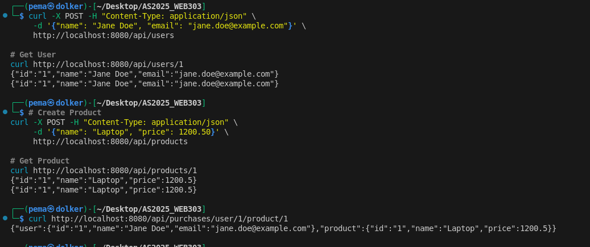

## **Practical 3: Full-Stack Microservices with gRPC, Databases & Service Discovery**

**Student Name:** Pema Dolker     
**Student ID:** 02230294     
**Module:** Microservice & Serverless Applications


## **1. Introduction**

This practical focuses on designing and implementing a **full microservices ecosystem** using:

* **gRPC** for high-performance inter-service communication
* **PostgreSQL + GORM** for persistence
* **Consul** for service discovery
* **API Gateway** for routing and request aggregation
* **Docker Compose** for orchestration

The primary goal was to fix the existing `api-gateway` implementation so that it no longer uses hard-coded ports and instead discovers services dynamically through Consul. Additionally, the composite “purchase” endpoint had to be corrected so that the API Gateway properly aggregates data from both services.

---

## **2. System Architecture Overview**

The complete architecture includes:

### **2.1 API Gateway**

* Acts as the **single entry point** for all external HTTP requests.
* Converts HTTP → gRPC.
* Dynamically resolves service addresses using **Consul**.
* Implements an **aggregated endpoint** that fetches both user and product details in one request.

### **2.2 Consul (Service Discovery)**

* Runs as a central registry.
* Each microservice registers itself with Consul on startup.
* API Gateway queries Consul to obtain the *current* service locations.

### **2.3 Users Service**

* gRPC-based microservice.
* Manages user records.
* Uses PostgreSQL (`users-db`) and GORM.
* Auto-registers with Consul.

### **2.4 Products Service**

* Similar structure to Users Service.
* Manages product records.
* Stores data inside its own isolated PostgreSQL instance.

### **2.5 Docker Compose**

* Orchestrates:

  * Consul
  * Users Service + Database
  * Products Service + Database
  * API Gateway

This setup ensures isolation, resilience, and independent scaling.

---

## **3. Tasks Completed**

### **3.1 Fixed Service Discovery in API Gateway**

Before fixing, the API Gateway was calling services via hard-coded addresses:

```
grpc.Dial("users-service:50051")
grpc.Dial("products-service:50052")
```

This defeats the purpose of using Consul.

**Fix Applied:**
✔ Implemented Consul client inside the Gateway
✔ Replaced static addresses with `Consul.Service("users-service")` lookups
✔ Ensured the gateway dynamically finds the correct healthy instance

---

### **3.2 Fixed Aggregated Endpoint**

Original composite endpoint was incorrect and did not:

* Communicate with services through Consul
* Handle concurrency properly
* Handle errors from either service
* Return aggregated result in the required format

**Fix Applied:**
✔ Parallel gRPC calls using Goroutines + WaitGroup
✔ Aggregated JSON response format
✔ Error handling for incomplete data
✔ Removed hard-coded ports

The endpoint now supports:

```
GET /api/purchases/user/{userId}/product/{productId}
```

Returns:

```json
{
  "user": { ... },
  "product": { ... }
}
```

---

## **4. Implementation Summary**

### **4.1 Users Service**

* gRPC server implemented using protobuf definitions.
* PostgreSQL connection:
  `host=users-db user=user password=password dbname=users_db`
* Registers itself in Consul via `AgentServiceRegistration`.
* Provides these RPCs:

  * `CreateUser`
  * `GetUser`

### **4.2 Products Service**

* Identical structure but with product model.
* Database:
  `host=products-db user=user password=password dbname=products_db`
* Provides RPCs:

  * `CreateProduct`
  * `GetProduct`

### **4.3 API Gateway**

* Uses **Gorilla Mux** for routing.
* Uses **gRPC Clients** for both services.
* New helper added:

  * `discoverService("users-service")`
  * `discoverService("products-service")`

This ensures that **every request** queries Consul for the correct service location.

---

## **5. Docker Compose Orchestration**

All services are launched using one command:

```
docker-compose up --build
```

This starts:

| Service          | Ports |
| ---------------- | ----- |
| Consul UI        | 8500  |
| Users-Service    | 50051 |
| Products-Service | 50052 |
| API Gateway      | 8080  |

---


## **6. Testing & Verification**

### **6.1 Verifying Service Registration in Consul**

Upon launching the system, navigating to:

```
http://localhost:8500
```

shows both services registered and healthy.


---

### **6.2 Sample API Requests (Postman / cURL)**

#### **Create a User**

```
curl -X POST -H "Content-Type: application/json" \
     -d '{"name":"Jane Doe","email":"jane@example.com"}' \
     http://localhost:8080/api/users
```

#### **Get a User**

```
curl http://localhost:8080/api/users/1
```

#### **Create a Product**

```
curl -X POST -H "Content-Type: application/json" \
     -d '{"name":"Laptop","price":1200}' \
     http://localhost:8080/api/products
```

#### **Get a Product**

```
curl http://localhost:8080/api/products/1
```

#### **Aggregated Purchase Data**

```
curl http://localhost:8080/api/purchases/user/1/product/1
```

Example Response:

```json
{
  "user": {
    "id": "1",
    "name": "Jane Doe",
    "email": "jane@example.com"
  },
  "product": {
    "id": "1",
    "name": "Laptop",
    "price": 1200
  }
}
```



---


## **7. Learning Outcomes Achieved**


✔ Implemented microservices using gRPC and Protocol Buffers.

✔ Set up stateful microservices using PostgreSQL + GORM.

✔ Integrating observability via service discovery and structured logs.

---

## **8. Conclusion**

This practical provided hands-on experience in building a production-style microservices system. By fixing the API Gateway and ensuring full Consul integration, the final architecture is:

* **Scalable**
* **Decoupled**
* **Discoverable**
* **Fault-tolerant**

The exercise demonstrated how microservices communicate efficiently via gRPC and how an API Gateway can aggregate responses across multiple services through dynamic discovery.

---
