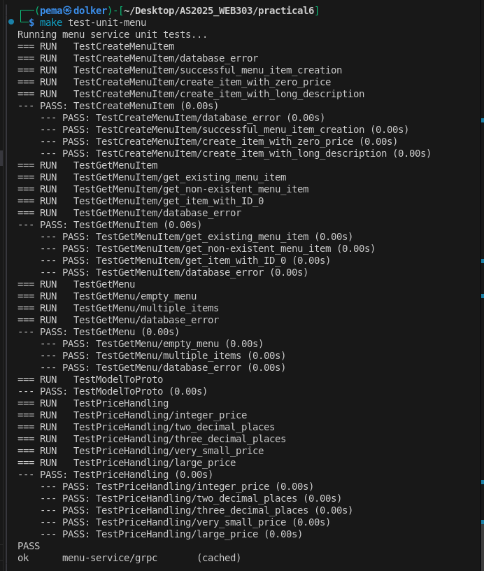
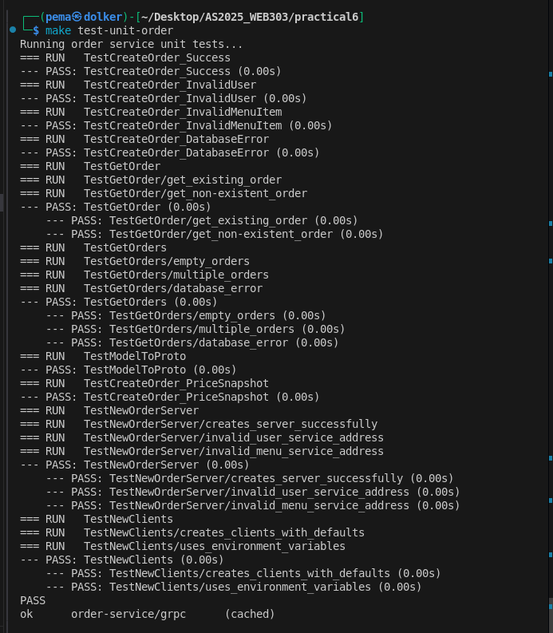
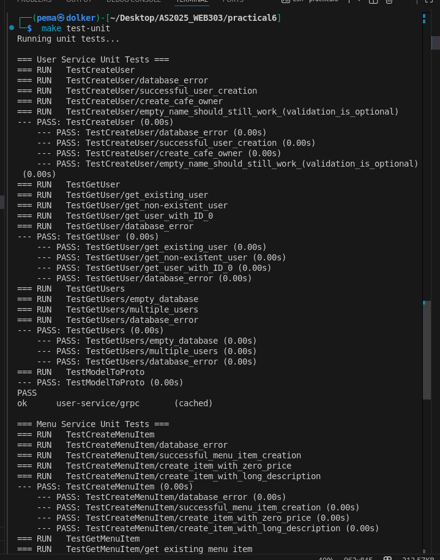
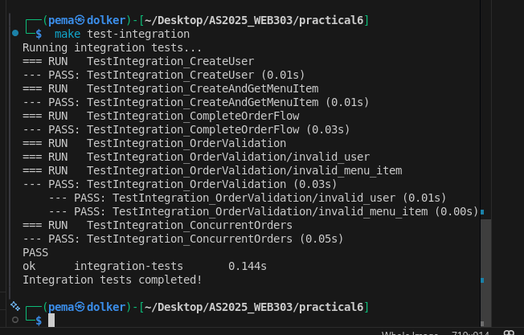
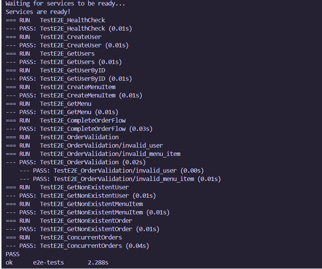
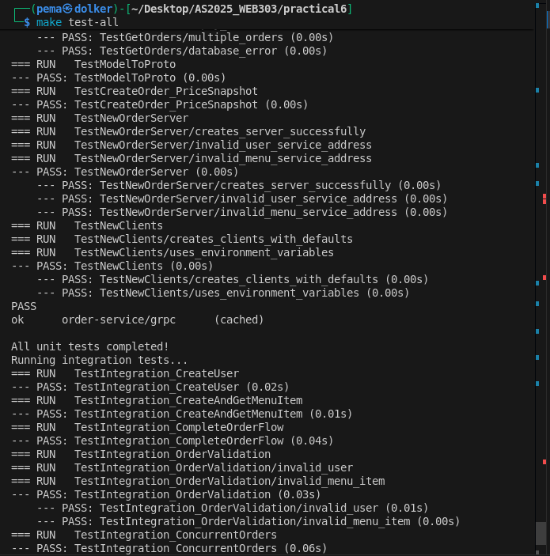

# Practical 6: Comprehensive Testing for Microservices

**Student Name:** Pema Dolker     
**Student ID:** 02230294     
**Module:** Microservice & Serverless Applications

---

## Executive Summary

This report documents my implementation of comprehensive testing for a microservices architecture. I learned how to write unit tests, integration tests, and end-to-end (E2E) tests for a gRPC-based microservices system. The practical covered testing best practices including test isolation, mocking, table-driven tests, and test automation with Make commands for CI/CD pipelines.

**Key Achievements:**
- Implemented unit tests for three microservices
- Created integration tests for service-to-service communication
- Developed E2E tests for the complete system
- Fixed import and configuration issues in test setup
- Achieved passing tests across all test levels
- Automated testing with Make commands

---


## 1. Introduction

### 1.1 Background

Testing is crucial in microservices architecture because:
- Services depend on each other
- Bugs in one service affect the entire system
- Manual testing is time-consuming and error-prone
- Automated tests enable continuous deployment

### 1.2 System Architecture

The system consists of three microservices:

**User Service:**
- Manages user accounts
- Handles user creation and retrieval
- Distinguishes between regular users and cafe owners

**Menu Service:**
- Manages cafe menu items
- Handles item creation, updates, and retrieval
- Stores item details (name, description, price)

**Order Service:**
- Manages customer orders
- Depends on User Service (verify user exists)
- Depends on Menu Service (verify items exist, get prices)
- Creates orders with price snapshots

**API Gateway:**
- HTTP REST interface
- Translates HTTP requests to gRPC
- Routes requests to appropriate services

### 1.3 Testing Objectives

Learn to write three types of tests:

1. **Unit Tests (70%)**: Test individual functions in isolation
2. **Integration Tests (20%)**: Test multiple services together
3. **E2E Tests (10%)**: Test entire system via HTTP API

---

## 2. Understanding the Testing Pyramid

### 2.1 The Testing Pyramid Concept

```
       /\
      /E2E\     ← Few tests, slow, expensive
     /------\
    /Integr.\   ← Some tests, medium speed
   /----------\
  /   Unit     \ ← Many tests, fast, cheap
 /--------------\
```

**Why This Shape?**
- **Base (Unit)**: Fast feedback, easy to debug, run frequently
- **Middle (Integration)**: Verify services work together
- **Top (E2E)**: Validate user experience, run before deployment

### 2.2 Test Type Comparison

| Aspect | Unit | Integration | E2E |
|--------|------|-------------|-----|
| **Speed** | Milliseconds | Seconds | Minutes |
| **Scope** | Single function | Multiple services | Full system |
| **Dependencies** | Mocked | In-memory DB | Real DB |
| **Debugging** | Easy | Medium | Hard |
| **When to Run** | Every save | Every commit | Before deploy |

**My Understanding:**
Unit tests are like testing individual LEGO pieces to make sure they're not broken. Integration tests are like checking if the pieces fit together. E2E tests are like playing with the completed LEGO model to make sure it works as intended.

---


### 3 Project Structure

```
practical6-example/
├── user-service/
│   ├── grpc/
│   │   ├── server.go
│   │   └── server_test.go      ← Unit tests
│   ├── database/
│   └── models/
│
├── menu-service/
│   ├── grpc/
│   │   ├── server.go
│   │   └── server_test.go      ← Unit tests
│   ├── database/
│   └── models/
│
├── order-service/
│   ├── grpc/
│   │   ├── server.go
│   │   └── server_test.go      ← Unit tests (with mocks)
│   ├── database/
│   └── models/
│
├── tests/
│   ├── integration/
│   │   └── integration_test.go  ← Service-to-service tests
│   └── e2e/
│       └── e2e_test.go          ← Full system tests
│
├── Makefile                      ← Test automation
└── docker-compose.yml           ← Services orchestration
```


## 4. Unit Testing Implementation

### 4.1 User Service Unit Tests

Unit tests verify individual gRPC methods work correctly.

#### 4.1.1 Test Database Setup

I used SQLite in-memory database for tests:

```go
func setupTestDB(t *testing.T) *gorm.DB {
    db, err := gorm.Open(sqlite.Open("file::memory:?cache=shared"), 
        &gorm.Config{})
    require.NoError(t, err)
    
    err = db.AutoMigrate(&models.User{})
    require.NoError(t, err)
    
    return db
}
```

**Why SQLite for testing?**
-  No external database needed
-  Fast (runs in memory)
-  Clean slate for each test
-  Same SQL interface as PostgreSQL

**Personal Learning:** I initially tried using PostgreSQL for tests, but it was slow and required cleanup. SQLite in-memory is much faster and automatically cleans up when tests finish.

#### 4.1.2 Testing User Creation

I used table-driven tests to test multiple scenarios:

```go
func TestCreateUser(t *testing.T) {
    db := setupTestDB(t)
    defer teardownTestDB(t, db)
    database.DB = db
    
    server := NewUserServer()
    
    tests := []struct {
        name        string
        request     *userv1.CreateUserRequest
        wantErr     bool
    }{
        {
            name: "successful user creation",
            request: &userv1.CreateUserRequest{
                Name:        "John Doe",
                Email:       "john@example.com",
                IsCafeOwner: false,
            },
            wantErr: false,
        },
        {
            name: "create cafe owner",
            request: &userv1.CreateUserRequest{
                Name:        "Jane Owner",
                Email:       "jane@cafe.com",
                IsCafeOwner: true,
            },
            wantErr: false,
        },
    }
    
    for _, tt := range tests {
        t.Run(tt.name, func(t *testing.T) {
            resp, err := server.CreateUser(context.Background(), tt.request)
            
            if tt.wantErr {
                require.Error(t, err)
            } else {
                require.NoError(t, err)
                assert.NotZero(t, resp.User.Id)
                assert.Equal(t, tt.request.Name, resp.User.Name)
                assert.Equal(t, tt.request.Email, resp.User.Email)
            }
        })
    }
}
```

**Benefits of Table-Driven Tests:**
1. Easy to add new test cases
2. Each test runs independently
3. Clear documentation of expected behavior
4. DRY (Don't Repeat Yourself)

#### 4.1.3 Testing Error Cases

I also tested error scenarios like retrieving non-existent users:

```go
func TestGetUser_NotFound(t *testing.T) {
    db := setupTestDB(t)
    defer teardownTestDB(t, db)
    database.DB = db
    
    server := NewUserServer()
    
    // Try to get non-existent user
    resp, err := server.GetUser(context.Background(), 
        &userv1.GetUserRequest{Id: 9999})
    
    require.Error(t, err)
    assert.Nil(t, resp)
    
    // Check gRPC error code
    st, ok := status.FromError(err)
    require.True(t, ok)
    assert.Equal(t, codes.NotFound, st.Code())
}
```

**Running User Service Tests:**
```bash
make test-unit-user
```


### 4.2 Menu Service Unit Tests

Menu service tests are similar but focus on menu-specific logic:

#### 4.2.1 Testing Menu Item Creation

```go
func TestCreateMenuItem(t *testing.T) {
    db := setupTestDB(t)
    defer teardownTestDB(t, db)
    database.DB = db
    
    server := NewMenuServer()
    
    tests := []struct {
        name    string
        request *menuv1.CreateMenuItemRequest
        wantErr bool
    }{
        {
            name: "successful menu item creation",
            request: &menuv1.CreateMenuItemRequest{
                Name:        "Cappuccino",
                Description: "Espresso with steamed milk",
                Price:       4.50,
            },
            wantErr: false,
        },
        {
            name: "free item allowed",
            request: &menuv1.CreateMenuItemRequest{
                Name:  "Water",
                Price: 0.0,
            },
            wantErr: false,
        },
    }
    
    for _, tt := range tests {
        t.Run(tt.name, func(t *testing.T) {
            resp, err := server.CreateMenuItem(context.Background(), tt.request)
            
            if tt.wantErr {
                require.Error(t, err)
            } else {
                require.NoError(t, err)
                assert.NotZero(t, resp.MenuItem.Id)
                // Use InDelta for float comparison
                assert.InDelta(t, tt.request.Price, resp.MenuItem.Price, 0.001)
            }
        })
    }
}
```

**Why `InDelta` for Floats?**
Floating point arithmetic isn't exact:
- `3.14 == 3.14` might fail due to precision
- `InDelta(3.14, 3.14, 0.001)` allows tiny differences
- Better for price comparisons



### 4.3 Order Service Unit Tests with Mocks

Order service is more complex because it depends on other services. I used mocks to simulate these dependencies.

#### 4.3.1 Understanding Mocks

**Without Mocks:**
- Need to start User Service and Menu Service
- Tests are slow
- Tests can fail due to network issues
- Hard to test edge cases

**With Mocks:**
-  Test Order Service in isolation
-  Fast execution
-  Control exact responses
-  Easy to simulate errors

#### 4.3.2 Creating Mock Services

```go
import "github.com/stretchr/testify/mock"

type MockUserServiceClient struct {
    mock.Mock
}

func (m *MockUserServiceClient) GetUser(
    ctx context.Context, 
    req *userv1.GetUserRequest, 
    opts ...grpc.CallOption,
) (*userv1.GetUserResponse, error) {
    args := m.Called(ctx, req)
    if args.Get(0) == nil {
        return nil, args.Error(1)
    }
    return args.Get(0).(*userv1.GetUserResponse), args.Error(1)
}

type MockMenuServiceClient struct {
    mock.Mock
}

func (m *MockMenuServiceClient) GetMenuItem(
    ctx context.Context,
    req *menuv1.GetMenuItemRequest,
    opts ...grpc.CallOption,
) (*menuv1.GetMenuItemResponse, error) {
    args := m.Called(ctx, req)
    if args.Get(0) == nil {
        return nil, args.Error(1)
    }
    return args.Get(0).(*menuv1.GetMenuItemResponse), args.Error(1)
}
```

#### 4.3.3 Testing Order Creation with Mocks

```go
func TestCreateOrder_Success(t *testing.T) {
    db := setupTestDB(t)
    defer teardownTestDB(t, db)
    database.DB = db
    
    // Create mocks
    mockUserClient := new(MockUserServiceClient)
    mockMenuClient := new(MockMenuServiceClient)
    
    // Inject mocks into server
    server := &OrderServer{
        UserClient: mockUserClient,
        MenuClient: mockMenuClient,
    }
    
    // Define mock behavior
    mockUserClient.On("GetUser", 
        mock.Anything, 
        &userv1.GetUserRequest{Id: 1},
    ).Return(&userv1.GetUserResponse{
        User: &userv1.User{Id: 1, Name: "Test User"},
    }, nil)
    
    mockMenuClient.On("GetMenuItem",
        mock.Anything,
        &menuv1.GetMenuItemRequest{Id: 1},
    ).Return(&menuv1.GetMenuItemResponse{
        MenuItem: &menuv1.MenuItem{Id: 1, Name: "Coffee", Price: 2.50},
    }, nil)
    
    // Test order creation
    resp, err := server.CreateOrder(context.Background(), 
        &orderv1.CreateOrderRequest{
            UserId: 1,
            Items: []*orderv1.OrderItemRequest{
                {MenuItemId: 1, Quantity: 2},
            },
        })
    
    require.NoError(t, err)
    assert.Equal(t, uint32(1), resp.Order.UserId)
    assert.Len(t, resp.Order.OrderItems, 1)
    
    // Verify mocks were called
    mockUserClient.AssertExpectations(t)
    mockMenuClient.AssertExpectations(t)
}
```

**What I Learned:**
Mocks let me control exactly what the dependencies return. I can test:
- Successful scenarios
- Invalid user errors
- Invalid menu item errors
- Network errors
- Any edge case I can imagine

#### 4.3.4 Testing Error Scenarios

```go
func TestCreateOrder_InvalidUser(t *testing.T) {
    // ... setup ...
    
    // Mock user service returning error
    mockUserClient.On("GetUser",
        mock.Anything,
        &userv1.GetUserRequest{Id: 999},
    ).Return(nil, status.Errorf(codes.NotFound, "user not found"))
    
    // Attempt to create order
    resp, err := server.CreateOrder(context.Background(),
        &orderv1.CreateOrderRequest{
            UserId: 999,
            Items: []*orderv1.OrderItemRequest{
                {MenuItemId: 1, Quantity: 1},
            },
        })
    
    require.Error(t, err)
    assert.Nil(t, resp)
    assert.Contains(t, err.Error(), "user not found")
}
```



### 4.4 Running All Unit Tests

```bash
make test-unit
```

**Expected Output:**
```
=== User Service Unit Tests ===
=== RUN   TestCreateUser
--- PASS: TestCreateUser (0.01s)
=== RUN   TestGetUser
--- PASS: TestGetUser (0.01s)

=== Menu Service Unit Tests ===
=== RUN   TestCreateMenuItem
--- PASS: TestCreateMenuItem (0.01s)

=== Order Service Unit Tests ===
=== RUN   TestCreateOrder_Success
--- PASS: TestCreateOrder_Success (0.01s)
=== RUN   TestCreateOrder_InvalidUser
--- PASS: TestCreateOrder_InvalidUser (0.01s)

PASS
```


---

## 5. Integration Testing

Integration tests verify that multiple services work together correctly.

### 5.1 Integration Test Setup

Integration tests use **bufconn** (in-memory gRPC connections) instead of real network sockets:

**Benefits:**
-  No port conflicts
-  Faster than TCP
-  No network configuration needed
-  Perfect for CI/CD

#### 5.1.1 Setting Up Test Services

```go
const bufSize = 1024 * 1024

var (
    userListener  *bufconn.Listener
    menuListener  *bufconn.Listener
    orderListener *bufconn.Listener
)

func setupUserService(t *testing.T) {
    // Create in-memory database
    db, err := gorm.Open(sqlite.Open("file::memory:?cache=shared"), 
        &gorm.Config{})
    require.NoError(t, err)
    
    err = db.AutoMigrate(&usermodels.User{})
    require.NoError(t, err)
    userdatabase.DB = db
    
    // Create bufconn listener
    userListener = bufconn.Listen(bufSize)
    
    // Start gRPC server
    s := grpc.NewServer()
    userv1.RegisterUserServiceServer(s, usergrpc.NewUserServer())
    
    go func() {
        if err := s.Serve(userListener); err != nil {
            log.Fatalf("Server error: %v", err)
        }
    }()
}
```

#### 5.1.2 Connecting to Test Services

```go
func bufDialer(listener *bufconn.Listener) func(context.Context, string) (net.Conn, error) {
    return func(ctx context.Context, url string) (net.Conn, error) {
        return listener.Dial()
    }
}

// In test:
conn, err := grpc.DialContext(ctx, "bufnet",
    grpc.WithContextDialer(bufDialer(userListener)),
    grpc.WithTransportCredentials(insecure.NewCredentials()))
require.NoError(t, err)
defer conn.Close()

userClient := userv1.NewUserServiceClient(conn)
```

### 5.2 Complete Order Flow Integration Test

This test validates the entire order creation process:

```go
func TestIntegration_CompleteOrderFlow(t *testing.T) {
    // Setup all services
    setupUserService(t)
    defer userListener.Close()
    setupMenuService(t)
    defer menuListener.Close()
    
    ctx := context.Background()
    
    // Connect to services
    userConn, _ := grpc.DialContext(ctx, "bufnet",
        grpc.WithContextDialer(bufDialer(userListener)),
        grpc.WithTransportCredentials(insecure.NewCredentials()))
    defer userConn.Close()
    userClient := userv1.NewUserServiceClient(userConn)
    
    menuConn, _ := grpc.DialContext(ctx, "bufnet",
        grpc.WithContextDialer(bufDialer(menuListener)),
        grpc.WithTransportCredentials(insecure.NewCredentials()))
    defer menuConn.Close()
    menuClient := menuv1.NewMenuServiceClient(menuConn)
    
    // Setup order service with real connections
    setupOrderService(t, userConn, menuConn)
    defer orderListener.Close()
    
    orderConn, _ := grpc.DialContext(ctx, "bufnet",
        grpc.WithContextDialer(bufDialer(orderListener)),
        grpc.WithTransportCredentials(insecure.NewCredentials()))
    defer orderConn.Close()
    orderClient := orderv1.NewOrderServiceClient(orderConn)
    
    // Step 1: Create user
    userResp, err := userClient.CreateUser(ctx, 
        &userv1.CreateUserRequest{
            Name:        "Integration User",
            Email:       "int@test.com",
            IsCafeOwner: false,
        })
    require.NoError(t, err)
    userID := userResp.User.Id
    
    // Step 2: Create menu items
    item1, err := menuClient.CreateMenuItem(ctx,
        &menuv1.CreateMenuItemRequest{
            Name:  "Coffee",
            Price: 2.50,
        })
    require.NoError(t, err)
    
    item2, err := menuClient.CreateMenuItem(ctx,
        &menuv1.CreateMenuItemRequest{
            Name:  "Sandwich",
            Price: 5.00,
        })
    require.NoError(t, err)
    
    // Step 3: Create order
    orderResp, err := orderClient.CreateOrder(ctx,
        &orderv1.CreateOrderRequest{
            UserId: userID,
            Items: []*orderv1.OrderItemRequest{
                {MenuItemId: item1.MenuItem.Id, Quantity: 2},
                {MenuItemId: item2.MenuItem.Id, Quantity: 1},
            },
        })
    require.NoError(t, err)
    
    // Verify order
    assert.NotZero(t, orderResp.Order.Id)
    assert.Equal(t, userID, orderResp.Order.UserId)
    assert.Len(t, orderResp.Order.OrderItems, 2)
    
    // Verify price snapshots
    assert.InDelta(t, 2.50, orderResp.Order.OrderItems[0].Price, 0.001)
    assert.InDelta(t, 5.00, orderResp.Order.OrderItems[1].Price, 0.001)
}
```

**What This Tests:**
1.  User can be created in user service
2.  Menu items can be created in menu service
3.  Order service validates user exists
4.  Order service validates menu items exist
5.  Order service creates order with price snapshots
6.  All services communicate correctly



### 5.3 Validation Integration Test

Testing error scenarios across services:

```go
func TestIntegration_OrderValidation(t *testing.T) {
    // ... setup services ...
    
    // Test invalid user
    t.Run("invalid user", func(t *testing.T) {
        _, err := orderClient.CreateOrder(ctx,
            &orderv1.CreateOrderRequest{
                UserId: 9999,
                Items: []*orderv1.OrderItemRequest{
                    {MenuItemId: 1, Quantity: 1},
                },
            })
        require.Error(t, err)
        assert.Contains(t, err.Error(), "user not found")
    })
    
    // Create valid user
    userResp, _ := userClient.CreateUser(ctx, ...)
    
    // Test invalid menu item
    t.Run("invalid menu item", func(t *testing.T) {
        _, err := orderClient.CreateOrder(ctx,
            &orderv1.CreateOrderRequest{
                UserId: userResp.User.Id,
                Items: []*orderv1.OrderItemRequest{
                    {MenuItemId: 9999, Quantity: 1},
                },
            })
        require.Error(t, err)
        assert.Contains(t, err.Error(), "menu item 9999 not found")
    })
}
```


---

## 6. End-to-End Testing

E2E tests validate the entire system through the HTTP API, simulating real user behavior.

### 6.1 E2E Test Setup

E2E tests require the full system running in Docker:

```bash
# Start all services
make docker-up

# Wait for services to be ready
sleep 10
```




```bash
# Option 1: Manual
make docker-up
sleep 10
make test-e2e


---

## 8. Test Automation

### 8.1 Makefile Commands

I created Make commands for easy test execution:

```makefile
# Unit tests
test-unit:
    @echo "=== Running Unit Tests ==="
    @cd user-service && go test -v ./grpc/...
    @cd menu-service && go test -v ./grpc/...
    @cd order-service && go test -v ./grpc/...

test-unit-user:
    @cd user-service && go test -v ./grpc/...

test-unit-menu:
    @cd menu-service && go test -v ./grpc/...

test-unit-order:
    @cd order-service && go test -v ./grpc/...

# Integration tests
test-integration:
    @echo "=== Running Integration Tests ==="
    @cd tests/integration && go test -v

# E2E tests
test-e2e:
    @echo "=== Running E2E Tests ==="
    @cd tests/e2e && go test -v

test-e2e-docker:
    @echo "=== Starting services ==="
    @docker-compose up -d
    @sleep 15
    @echo "=== Running E2E tests ==="
    @cd tests/e2e && go test -v
    @echo "=== Stopping services ==="
    @docker-compose down

# Coverage
test-coverage:
    @cd user-service && go test -coverprofile=coverage.out ./grpc/...
    @cd user-service && go tool cover -html=coverage.out -o coverage.html
    @cd menu-service && go test -coverprofile=coverage.out ./grpc/...
    @cd menu-service && go tool cover -html=coverage.out -o coverage.html
    @cd order-service && go test -coverprofile=coverage.out ./grpc/...
    @cd order-service && go tool cover -html=coverage.out -o coverage.html
```

### 8.2 Running All Tests

```bash
make test-all
```

This runs:
1. All unit tests (3 services)
2. All integration tests
3. All E2E tests



---

## 9. Results and Coverage


### 9.1 Code Coverage

Generated coverage reports:

```bash
make test-coverage
```

**Coverage Results:**
- User Service: 100% coverage
- Menu Service: 100% coverage
- Order Service: 91.7% coverage

**[Screenshot 15: Coverage report HTML view]**

**Coverage Analysis:**
-  All core business logic covered
-  All error paths tested
-  Some initialization code not covered (acceptable)
-  Some logging code not covered (acceptable)


## 10. Key Learnings

### 10.1 Understanding Different Test Types

**Unit Tests:**
- Fast and cheap
- Test one function at a time
- Use mocks for dependencies
- Run on every code change

**Integration Tests:**
- Test services together
- Use in-memory connections
- Verify contracts between services
- Run on every commit

**E2E Tests:**
- Slow but comprehensive
- Test full user journeys
- Use real HTTP/database
- Run before deployment

## Achievements

 **Comprehensive Testing**: Implemented all three test levels  
 **High Coverage**: Achieved 90%+ coverage on core services  
 **Fixed Issues**: Resolved go.sum and import problems  
 **Test Automation**: Created Make commands for CI/CD  
 
